# Prisma Class Diagram

Nguon: `backend/prisma/schema.prisma`

Quy uoc:
- Cardinality o dau class cha `1` la bat buoc, `0..1` la tuy chon.
- Cardinality o dau class con `0..*` la mot-nhieu.
- Cac bang trung gian duoc ve thanh class rieng de giu du thuoc tinh va quan he.

```mermaid
%%{init: {"theme": "base", "themeVariables": {"fontFamily": "Arial"}}}%%
classDiagram
direction LR

class khoa {
  +khoaId: Int
  +maKhoa: String
  +tenKhoa: String
  +ngayTao: DateTime?
}

class boMon {
  +boMonId: Int
  +khoaId: Int
  +maBoMon: String
  +tenBoMon: String
  +ngayTao: DateTime?
}

class nganh {
  +nganhId: Int
  +khoaId: Int
  +boMonQuanLyId: Int?
  +maNganh: String
  +tenNganh: String
  +ngayTao: DateTime?
}

class chuyenNganh {
  +chuyenNganhId: Int
  +nganhId: Int
  +maChuyenNganh: String?
  +tenChuyenNganh: String
  +ngayTao: DateTime?
}

class coSo {
  +coSoId: Int
  +maCoSo: String
  +tenCoSo: String
  +diaChi: String?
}

class phongHoc {
  +phongHocId: Int
  +coSoId: Int
  +maPhong: String
  +tenPhong: String?
  +sucChua: Int?
  +loaiPhong: phongHocLoaiPhong?
}

class khoaHoc {
  +khoaHocId: Int
  +maKhoaHoc: String
  +tenKhoaHoc: String
  +namBatDau: Int
  +namKetThuc: Int
}

class lop {
  +lopId: Int
  +maLop: String
  +tenLop: String
  +khoaHocId: Int
  +nganhId: Int
  +chuyenNganhId: Int?
  +coSoId: Int?
  +heDaoTao: String?
  +siSo: Int?
  +thoiGianNhapHoc: String?
  +thoiGianTotNghiep: String?
  +trangThai: lopTrangThai?
  +ghiChu: String?
  +ngayTao: DateTime?
}

class nguoiDung {
  +nguoiDungId: Int
  +email: String
  +matKhauHash: String
  +hoTen: String
  +vaiTro: nguoiDungVaiTro
  +trangThai: nguoiDungTrangThai
  +ngayTao: DateTime?
  +ngayCapNhat: DateTime?
}

class giangVien {
  +giangVienId: Int
  +nguoiDungId: Int?
  +boMonId: Int?
  +maGiangVien: String?
  +hoTen: String
  +email: String?
  +soDienThoai: String?
  +hocVi: String?
  +chucDanh: String?
  +chucVu: giangVienChucVu?
  +dinhMucGio: Decimal?
  +trangThai: giangVienTrangThai?
  +ngayTao: DateTime?
}

class hocPhan {
  +hocPhanId: Int
  +maHocPhan: String
  +tenHocPhan: String
  +soTinChi: Decimal
  +soTinChiLyThuyet: Decimal?
  +soTinChiThucHanh: Decimal?
  +soTietLyThuyet: Int
  +soTietThucHanh: Int
  +tongSoTiet: Int
  +heSoSiSo: Decimal?
  +heSoDacThu: Decimal?
  +loaiHocPhan: hocPhanLoaiHocPhan?
  +boMonId: Int?
  +moTa: String?
  +ngayTao: DateTime?
  +ngayCapNhat: DateTime?
}

class giangVienHocPhan {
  +giangVienHocPhanId: Int
  +giangVienId: Int
  +hocPhanId: Int
  +coTheDayLyThuyet: Boolean?
  +coTheDayThucHanh: Boolean?
  +mucDoUuTien: Int?
  +ghiChu: String?
}

class namHoc {
  +namHocId: Int
  +maNamHoc: String
  +ngayBatDau: DateTime?
  +ngayKetThuc: DateTime?
  +trangThai: namHocTrangThai?
  +ngayTao: DateTime?
}

class hocKy {
  +hocKyId: Int
  +maHocKy: String
  +tenHocKy: String
  +thuTuTrongNam: Int?
  +trangThai: hocKyTrangThai?
}

class chuongTrinhDaoTao {
  +chuongTrinhId: Int
  +maChuongTrinh: String
  +tenChuongTrinh: String
  +nganhId: Int
  +boMonId: Int?
  +chuyenNganhId: Int?
  +khoaHocId: Int?
  +soHocKy: Int
  +tongTinChi: Decimal?
  +trinhDoDaoTao: String?
  +hinhThucDaoTao: String?
  +trangThai: chuongTrinhDaoTaoTrangThai?
  +moTa: String?
  +ngayTao: DateTime?
  +ngayCapNhat: DateTime?
}

class chuongTrinhHocPhan {
  +chuongTrinhHocPhanId: Int
  +chuongTrinhId: Int
  +hocPhanId: Int
  +hocKyDuKien: Int
  +batBuoc: Boolean?
  +thuTu: Int?
  +dieuKienTienQuyet: String?
  +ghiChu: String?
}

class lopChuongTrinh {
  +lopChuongTrinhId: Int
  +lopId: Int
  +chuongTrinhId: Int
  +ngayApDung: DateTime?
  +trangThai: lopChuongTrinhTrangThai?
  +ghiChu: String?
}

class tienDoHocPhanLop {
  +tienDoId: Int
  +lopId: Int
  +chuongTrinhHocPhanId: Int
  +hocKyDuKien: Int
  +trangThai: tienDoHocPhanLopTrangThai?
  +keHoachHocKyId: Int?
  +namHocHoanThanhId: Int?
  +hocKyHoanThanhId: Int?
  +ghiChu: String?
}

class keHoachDaoTao {
  +keHoachId: Int
  +namHocId: Int
  +khoaId: Int
  +maKeHoach: String
  +tenKeHoach: String
  +trangThai: keHoachDaoTaoTrangThai?
  +ghiChu: String?
  +nguoiTaoId: Int?
  +nguoiDuyetId: Int?
  +ngayTao: DateTime?
  +ngayCapNhat: DateTime?
}

class keHoachHocKy {
  +keHoachHocKyId: Int
  +keHoachId: Int
  +hocKyId: Int
  +tenKeHoachHocKy: String?
  +trangThai: keHoachHocKyTrangThai?
  +ghiChu: String?
}

class tuanDaoTao {
  +tuanId: Int
  +keHoachId: Int
  +soTuan: Int
  +tenTuan: String?
  +ngayBatDau: DateTime?
  +ngayKetThuc: DateTime?
  +loaiTuan: tuanDaoTaoLoaiTuan?
  +ghiChu: String?
}

class keHoachLopHocPhan {
  +keHoachLopHocPhanId: Int
  +keHoachHocKyId: Int
  +lopId: Int
  +hocPhanId: Int
  +chuongTrinhHocPhanId: Int?
  +siSo: Int?
  +coThucHanh: Boolean?
  +coChiaNhomThucHanh: Boolean?
  +soNhomThucHanh: Int?
  +nguonTao: keHoachLopHocPhanNguonTao?
  +lyDoThem: String?
  +trangThai: keHoachLopHocPhanTrangThai?
  +ghiChu: String?
  +ngayTao: DateTime?
}

class nhomHocPhan {
  +nhomHocPhanId: Int
  +keHoachLopHocPhanId: Int
  +maNhom: String
  +tenNhom: String?
  +loaiNhom: nhomHocPhanLoaiNhom
  +siSo: Int?
  +soTiet: Int?
  +ghiChu: String?
}

class phanCongGiangDay {
  +phanCongId: Int
  +nhomHocPhanId: Int
  +giangVienId: Int
  +vaiTro: phanCongGiangDayVaiTro?
  +loaiGiangDay: loaiGiangDay?
  +soTietPhanCong: Decimal?
  +heSoLop: Decimal?
  +soTietQuyDoi: Decimal?
  +soTinChiTinhGio: Decimal?
  +soTietTinhGio: Int?
  +siSo: Int?
  +heSoSiSo: Decimal?
  +heSoDacThu: Decimal?
  +heSoVaiTro: Decimal?
  +gioCoBan: Decimal?
  +gioQuyDoi: Decimal?
  +canhBao: String?
  +trangThai: phanCongGiangDayTrangThai?
  +ghiChu: String?
  +ngayTao: DateTime?
  +ngayCapNhat: DateTime?
}

class quyDinhHeSoSiSo {
  +quyDinhHeSoSiSoId: Int
  +loaiGiangDay: loaiGiangDay
  +siSoTu: Int
  +siSoDen: Int?
  +heSo: Decimal
  +maHeSo: String?
  +namHocId: Int?
  +trangThai: quyDinhTrangThai?
  +ghiChu: String?
  +ngayTao: DateTime?
}

class quyDinhTinhGio {
  +quyDinhTinhGioId: Int
  +loaiGiangDay: loaiGiangDay
  +donViTinh: donViTinhGio
  +gioCoBan: Decimal
  +namHocId: Int?
  +trangThai: quyDinhTrangThai?
  +moTa: String?
  +ngayTao: DateTime?
}

class dinhMucGiangVien {
  +dinhMucId: Int
  +giangVienId: Int
  +namHocId: Int
  +loaiDinhMuc: loaiDinhMucGV
  +tyLeDinhMuc: Decimal
  +gioTieuChuan: Decimal
  +gioMienGiam: Decimal
  +gioPhaiDay: Decimal
  +ghiChu: String?
  +ngayTao: DateTime?
  +ngayCapNhat: DateTime?
}

class lichDayTheoTuan {
  +lichTuanId: Int
  +phanCongId: Int
  +tuanId: Int
  +phongHocId: Int?
  +soTiet: Decimal
  +noiDungGiangDay: String?
  +ghiChu: String?
  +ngayTao: DateTime?
}

%% Co cau to chuc - danh muc
khoa "1" --> "0..*" boMon : khoa
khoa "1" --> "0..*" nganh : khoa
boMon "0..1" --> "0..*" nganh : boMonQuanLy
nganh "1" --> "0..*" chuyenNganh : nganh
coSo "1" --> "0..*" phongHoc : coSo
khoaHoc "1" --> "0..*" lop : khoaHoc
nganh "1" --> "0..*" lop : nganh
chuyenNganh "0..1" --> "0..*" lop : chuyenNganh
coSo "0..1" --> "0..*" lop : coSo

%% Nguoi dung - giang vien - hoc phan
nguoiDung "0..1" --> "0..*" giangVien : nguoiDung
boMon "0..1" --> "0..*" giangVien : boMon
boMon "0..1" --> "0..*" hocPhan : boMon
giangVien "1" --> "0..*" giangVienHocPhan : giangVien
hocPhan "1" --> "0..*" giangVienHocPhan : hocPhan

%% Chuong trinh dao tao
nganh "1" --> "0..*" chuongTrinhDaoTao : nganh
boMon "0..1" --> "0..*" chuongTrinhDaoTao : boMon
chuyenNganh "0..1" --> "0..*" chuongTrinhDaoTao : chuyenNganh
khoaHoc "0..1" --> "0..*" chuongTrinhDaoTao : khoaHoc
chuongTrinhDaoTao "1" --> "0..*" chuongTrinhHocPhan : chuongTrinh
hocPhan "1" --> "0..*" chuongTrinhHocPhan : hocPhan
lop "1" --> "0..*" lopChuongTrinh : lop
chuongTrinhDaoTao "1" --> "0..*" lopChuongTrinh : chuongTrinh
lop "1" --> "0..*" tienDoHocPhanLop : lop
chuongTrinhHocPhan "1" --> "0..*" tienDoHocPhanLop : chuongTrinhHocPhan

%% Ke hoach dao tao
namHoc "1" --> "0..*" keHoachDaoTao : namHoc
khoa "1" --> "0..*" keHoachDaoTao : khoa
nguoiDung "0..1" --> "0..*" keHoachDaoTao : nguoiTao
nguoiDung "0..1" --> "0..*" keHoachDaoTao : nguoiDuyet
keHoachDaoTao "1" --> "0..*" keHoachHocKy : keHoach
hocKy "1" --> "0..*" keHoachHocKy : hocKy
keHoachDaoTao "1" --> "0..*" tuanDaoTao : keHoach
keHoachHocKy "0..1" --> "0..*" tienDoHocPhanLop : keHoachHocKy
namHoc "0..1" --> "0..*" tienDoHocPhanLop : namHocHoanThanh
hocKy "0..1" --> "0..*" tienDoHocPhanLop : hocKyHoanThanh

%% Ke hoach lop hoc phan - phan cong - lich day
keHoachHocKy "1" --> "0..*" keHoachLopHocPhan : keHoachHocKy
lop "1" --> "0..*" keHoachLopHocPhan : lop
hocPhan "1" --> "0..*" keHoachLopHocPhan : hocPhan
chuongTrinhHocPhan "0..1" --> "0..*" keHoachLopHocPhan : chuongTrinhHocPhan
keHoachLopHocPhan "1" --> "0..*" nhomHocPhan : keHoachLopHocPhan
nhomHocPhan "1" --> "0..*" phanCongGiangDay : nhomHocPhan
giangVien "1" --> "0..*" phanCongGiangDay : giangVien
phanCongGiangDay "1" --> "0..*" lichDayTheoTuan : phanCong
tuanDaoTao "1" --> "0..*" lichDayTheoTuan : tuan
phongHoc "0..1" --> "0..*" lichDayTheoTuan : phongHoc

%% Quy dinh va dinh muc
namHoc "0..1" --> "0..*" quyDinhHeSoSiSo : namHoc
namHoc "0..1" --> "0..*" quyDinhTinhGio : namHoc
giangVien "1" --> "0..*" dinhMucGiangVien : giangVien
namHoc "1" --> "0..*" dinhMucGiangVien : namHoc
```

